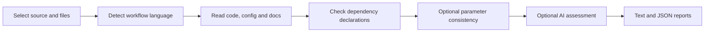

# Workflow documentation checker

For an isolated installation, see [Docker build and usage](DOCKER.md).

Check selected workflow code, configuration and documentation using static checks, with optional Gemini quality assessment. Supports Nextflow, Snakemake, CWL and WDL. It reads workflow files; it does not execute them or verify runtime performance.

## Start in a minute

Python 3.10+ is required. From this repository:

```bash
python -m venv .venv
source .venv/bin/activate
python -m pip install ".[test]"
mkdir -p reports
doccheck examples/workflow --source-type local \
  --config examples/files.json --usage-check \
  --output reports/documentation.txt --json-output reports/documentation.json
python -m pytest -q
```

The bundled example passes the static checks. Its environment file is sample evidence; no workflow dependencies are installed or executed by `doccheck`.

For your project, replace `examples/workflow` and select paths **relative to that project directory**:

```bash
doccheck /path/to/workflow --source-type local \
  --files main.nf nextflow.config README.md --usage-check \
  --json-output reports/my-workflow.json
```

A repository URL can be supplied with the default `--source-type github`. Git must be installed and able to access that URL. The repository is cloned to a temporary directory and removed after assessment. To assess a single local file, pass its path and `--source-type local`; no `--files` is needed. Single-file assessments generally report incomplete workflow evidence.

## Parameters

| Parameter | Default | Meaning |
|---|---|---|
| `source` | Required | Git repository URL, local directory or local file. |
| `--source-type` | `github` | `github` clones the URL; `local` reads existing files. |
| `--files PATH ...` | None | Selected paths relative to the workflow root; takes precedence over `--config`. Required for a directory/URL unless a config is supplied. |
| `--config FILE` | None | JSON containing `{"files": [...]}`; legacy `custom_files` also accepted. |
| `--pipeline-type` | Auto-detected | `nextflow`, `snakemake`, `cwl` or `wdl`. Specify for ambiguous/mixed repositories. |
| `--usage-check` | Off | Compare parameter names in code, config and documentation. Legacy spelling: `--usage_check`. |
| `--ai-analysis` | Off | Enable Gemini quality assessment. Legacy spelling: `--ai_analysis`. |
| `--output FILE` | Console only | Write the text report. Parent directory must exist. |
| `--json-output FILE` | None | Write structured results. Parent directory must exist. |
| `--verbose` | Off | Include a traceback on execution errors. |

## What gets checked



- **Presence:** selected readable documentation and workflow code must both be available for a complete workflow assessment. Configuration presence is recorded separately.
- **Dependency declarations:** scans the workflow directory for YAML with a `dependencies` list. Checks fixed version declarations for Conda packages and nested pip requirements. Unversioned packages, ranges, wildcards and unpinned pip URLs fail. This checks declarations, not resolved lockfiles or the installed environment.
- **Parameter consistency:** extracts parameter names using language-specific heuristics and compares them across selected code/config/docs. Built-in names are filtered. Both code and documentation must yield parameter evidence; optional absent config is allowed. Extraction is heuristic, not a full language parser.
- **AI quality:** examines up to the first 6,000 characters of each selected file, extracts a score and assigns Gold/Silver/Bronze. These scores do not prove that documented commands execute correctly. AI prompts for configuration remain Nextflow-oriented.

**Docker pinning is not assessed.** If Dockerfiles are detected, complete dependency coverage is not claimed, even if Conda declarations pass. Missing/empty Conda evidence also remains incomplete. Malformed recognized environment files produce an error.

## Results and exit codes

JSON includes `overall_assessment.status`, individual `checks`, `dependency_pinning`, `parameter_consistency`, selected files, timestamp and AI usage. Statuses are:

| Status | Meaning |
|---|---|
| `PASS` | Every enabled, applicable assessment has sufficient evidence and passes. |
| `FAIL` | Dependency or parameter evidence fails a check. |
| `NOT_CHECKED` | Evidence is missing or outside the implemented scope. |
| `ERROR` | A check could not be performed. |

`ERROR` takes precedence over `FAIL`, which takes precedence over incomplete evidence. Static scores are `null`; numeric scores and medals describe **AI quality only** and do not override the static status. Parameter checking is opt-in, so inspect the `checked` field when interpreting a report.

Exit **0**: assessment passes. Exit **1**: report produced with a failed or incomplete assessment. Exit **2**: invalid invocation, unreadable input/output, or execution/check error. On errors before report creation, consult the console message; a JSON report may not be written.

## Dependencies and optional AI

| Installation | Dependencies/purpose |
|---|---|
| Core | PyYAML, GitPython, packaging, requests. No AI package is imported for static checks. |
| `.[test]` | Adds pytest. |
| `.[ai]` | Adds LangChain and its Google GenAI integration. |
| External Git | Required only for repository URL inputs. |

```bash
python -m pip install ".[ai]"
export GOOGLE_API_KEY="your-key"
doccheck examples/workflow --source-type local \
  --config examples/files.json --usage-check --ai-analysis
```

AI mode sends selected file excerpts to the configured Gemini model (`gemini-3-flash-preview`). Without the environment variable, the CLI prompts for the key. Model/service availability and paid AI requests are not part of the offline tests.

## Development

`python -m pytest -q` runs the migrated analyzer tests, restored fixtures and CLI/dependency regressions. CI runs the static suite on Python 3.12. The existing module entry point remains available as `python CurrentDocChecker.py ...`; installed use is `doccheck ...`.

To assess reproducibility of actual outputs, run the separate ComparisonTool against two completed workflow-output directories. Keep its comparison report alongside this documentation report; there is currently no combined report command.
